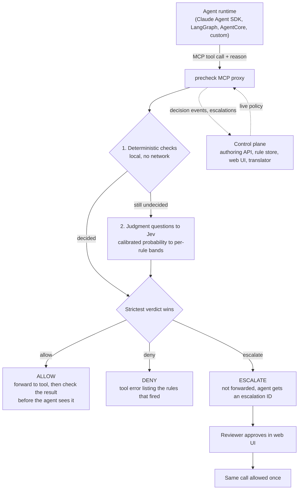
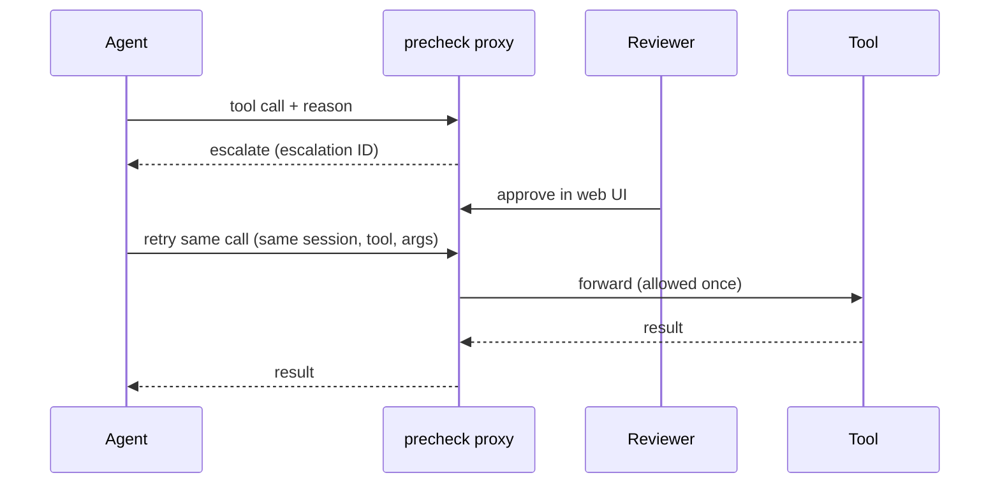

# precheck

**A policy-enforcement proxy for AI agents.**

Before an agent runs a consequential tool call, writes to an external system, or takes in
untrusted data, precheck intercepts the call and returns one of three verdicts: **`allow`**,
**`deny`**, or **`escalate`**.

- **Deterministic checks** run locally in plain code: numeric bounds, allowlists, RE2 regex,
  exact matches, required fields.
- **Judgment checks** (*"Does the conversation justify this exception?"*) go to
  [Jev](https://docs.typesafe.ai/api) (TypeSafe AI), which returns calibrated probabilities.
  Per-rule thresholds turn those into verdicts.
- **Plain-language authoring**: write *"Refunds over $500 need a manager"* and the translator
  produces a structured rule with test cases for you to review, calibrate, and publish.

> **Status:** early MVP. No authentication yet. Bind to `localhost` only.

## Why precheck?

Prompt instructions like *"only refund legitimate issues"* eventually fail to jailbreaks,
hallucinations, injected instructions, or conversation drift. Real business policy needs
hard checks where code can decide, calibrated judgment where a person used to use
discretion, and a third outcome: *"a person should look at this."*

## How it compares to AWS

AWS covers a lot of this already.
[AgentCore Gateway Policy](https://docs.aws.amazon.com/bedrock-agentcore/latest/devguide/policy.html)
checks every tool call against Cedar rules. You can write those rules in plain English and
have them generated and checked by automated reasoning. Policies can also use Bedrock
Guardrails signals such as prompt-attack and content-safety scores. Anything else can go in a
Lambda interceptor, including calling your own LLM.

The gap is narrower than "AWS can't do judgment." When a rule depends on judgment
(*"allow a late refund only if the customer gave plausible evidence of a carrier delay"*),
the pieces exist but you have to put them together yourself.

| | AWS (AgentCore Policy + Guardrails + Lambda) | precheck |
|---|---|---|
| **Authoring** | Plain English to Cedar, validated by automated reasoning. | Plain English to rules, with generated test cases you label and calibrate against. |
| **Deterministic rules** | Cedar: field comparisons, session events, budgets, identity. Mature and formally analyzable. | Predicates (bounds, allowlists, regex, required fields). Simpler and not formally analyzed. |
| **Judgment rules** | Not in Cedar itself. Guardrails score built-in categories; for a custom question you call your own LLM from a Lambda and turn its answer into a signal. | Built in. A rule asks Jev a question, and per-rule probability thresholds (calibrated against labeled cases) map the answer to a verdict. |
| **Verdicts** | Allow or deny. Approvals are built by hand (an approval tool plus a rule that requires it). | Allow, deny, or **escalate**. Escalated calls are held, approved in the UI, then allowed once on retry. |
| **Context for judgment** | What you pass into your Lambda. | Agent purpose, user goal, the agent's required reason for the call, and session history. |
| **Operations** | Fully managed; identity, log-only mode, and rate limits built in. | Self-hosted MVP. No auth or log-only mode yet. |

**In practice:** use AgentCore Policy or IAM for identity, exact limits, and budgets.
Put precheck in front of the tools where the rule needs judgment, calibration, or a person
to approve.

## How it works

precheck sits inline between the agent and its tools. Deterministic rules run first; Jev is
called only if a rule still needs judgment. The strictest verdict wins
(deny, then escalate, then allow).



The proxy fails closed until it first loads a policy, then keeps the last good copy.
Agents can propose rules through the authoring MCP, but can't publish them.

### Escalation flow



## Integration patterns

| Pattern | How | Status |
|---|---|---|
| **MCP proxy** (recommended) | Point the agent's MCP client at the proxy. Pass `precheck/session`, `precheck/agent_id`, and `precheck/user_goal` in request `_meta`. | Working |
| **Framework node** | Call `precheck.core.engine.evaluate(rules, check_request, jev)` before dispatching a tool. | Engine works as a library; no packaged middleware or approval flow yet |
| **AgentCore Gateway MCP target** | Register the proxy as a Gateway target in front of your MCP servers. | Untested |
| **AgentCore Gateway interceptor** | Lambda interceptors call precheck on requests and responses. | Planned |
| **REST/gRPC sidecar** | Reverse proxy that only forwards allowed calls. | Planned |

## Run locally

Requires Docker with Compose v2.

```sh
cp .env.example .env   # add TYPESAFE_API_KEY (and ANTHROPIC_API_KEY for the translator)
docker compose up      # or: make up
```

| Service | Address |
|---|---|
| Web UI | http://127.0.0.1:5173 |
| API | http://127.0.0.1:8000/api/health (docs at `/docs`) |
| Enforcement proxy | http://127.0.0.1:8200/mcp |
| Authoring MCP | http://127.0.0.1:8001/mcp |
| Mock tools / test agent | http://127.0.0.1:8100/mcp, http://127.0.0.1:8300 |

All ports bind to `127.0.0.1`. Data is stored in SQLite under `./data/`.
Run the end-to-end scenarios in `examples/scenarios/` with `make test-scenarios`.

## Development

```sh
make test         # unit tests (in containers, no network)
make lint         # ruff + oxlint
make typecheck    # mypy (strict) + tsc
make e2e          # Playwright against the running stack
make gen-types    # regenerate frontend API types from OpenAPI
make test-live    # real Jev / Anthropic calls (costs money)
make bench-proxy  # proxy overhead benchmark (needs `make up`)
```

### Layout

A `uv` workspace of Python packages under the `precheck` namespace, plus a React app.

| Path | What it is | May import |
|---|---|---|
| `packages/core` | Rule schema, Jev client, decision engine | — |
| `packages/translator` | Plain language to rules (Claude) | `core` |
| `packages/server` | Authoring API, rule store, authoring MCP | `core`, `translator` |
| `packages/mcp-proxy` | Enforcement proxy | `core` |
| `packages/lab` | Mock tools and test agent (dev only) | `core` |
| `apps/web` | React UI | — |

`tests/test_layering.py` enforces the import rules. Shared examples live in `examples/`,
recorded API responses in `fixtures/`, and Dockerfiles in `deploy/`.

## Data boundary

- **Deterministic rules** run in-process; no payload data leaves your host.
- **Judgment checks** send only the fields in each rule's `state_template` to Jev
  (directly or via `JEV_BASE_URL`).
- **Decision log:** every call is recorded with its verdict, per-rule results, and rule and
  policy versions, for audit and replay.

## License

Apache-2.0. See [LICENSE](LICENSE).